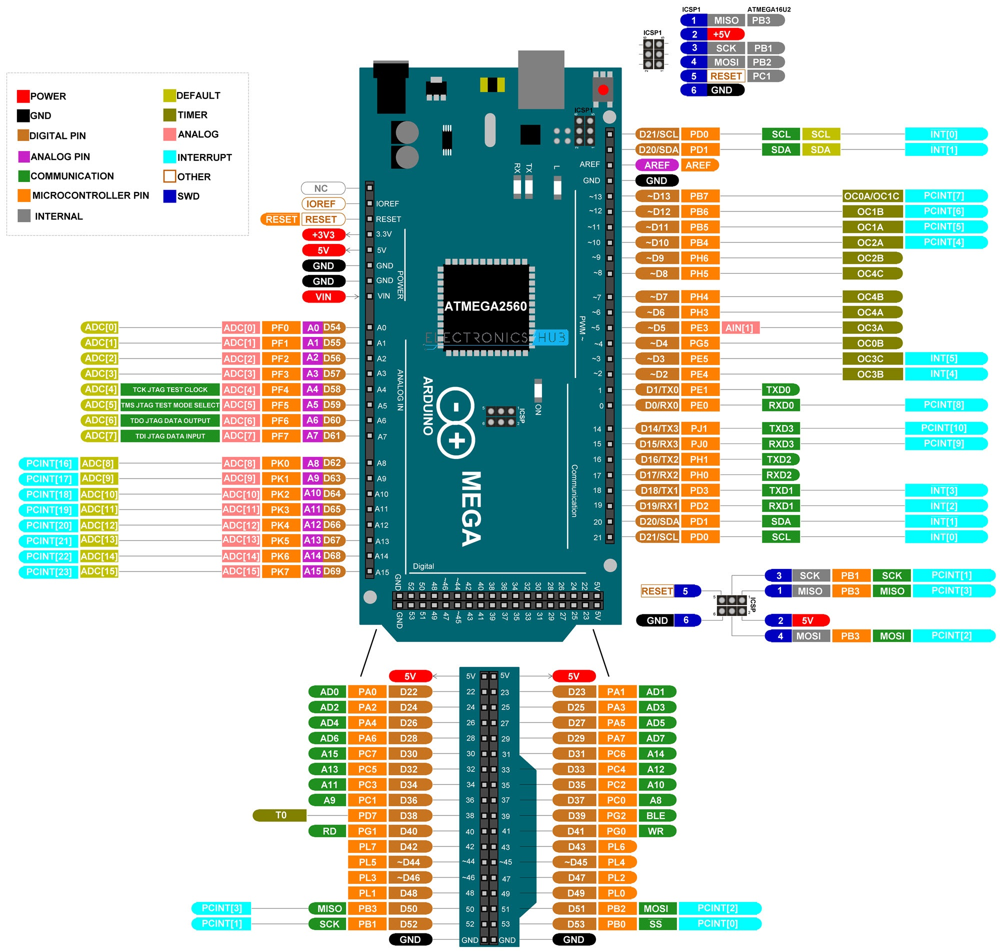

# Equipamento de Monitoriamento Ambiental

Com o objetivo do trabalho em mente, um código em C criado foi criado para controlar um display LCD usando um microcontrolador AVR. O código está configurado para utilizar um microcontrolador com portas de saída e temporização para controlar o display LCD.

| Manipulação dos Registradores no Arduino Mega |
|-------------------------------|
||

## 🤖 Descrição do [código](src/LCD/LCD.c):
>1. Inclusão de bibliotecas
>2. Definição de constantes
>3. **Função pulse_E()** com a função de criar um pulso no pino E (Enable) para sincronizar os dados enviados ao LCD.
>4. **Função cmd_LCD(unsigned char c, char cd)** para enviar comandos ou dados ao LCD.
>    - 'c' é o byte de comando ou dado a ser enviado.
>    - 'cd' é um indicador que determina se você está enviando um comando (0) ou um dado (1) para o LCD.
>    - A função configura os pinos RS de acordo com 'cd' e, em seguida, envia os dados em formato de 4 bits ou 8 bits, dependendo da configuração de 'nibble_dados'.
>5. **Função start()** usada para configurar as portas necessárias como saídas e inicializa o LCD e inicializar o LCD com os comandos necessários, como a seleção do modo de 4 bits e outras configurações iniciais.
>6. <b>Função show_LCD (const char *str)</b> usada para exibição das sequências de caracteres no LCD.
>    - Ela chama cmd_LCD() para enviar cada caractere da string para o LCD até que o final da string seja alcançado.
>7. **Função main()** onde o programa executa as funções conforme a necessidade e entra em um loop infinito com 'while (1);', mantendo o LCD exibindo a mensagem.

## 🖥️ Comandos padrões para displays LCD:

| Comando Hexadecimal | Comando Decimal | Função                                                                                                  |
|---------------------|-----------------|---------------------------------------------------------------------------------------------------------|
| 0x01                | 1               | Limpar o display e retornar o cursor para a posição inicial.                                           |
| 0x02                | 2               | Retornar o cursor para a posição inicial sem apagar o display.                                          |
| 0x04                | 4               | Ativar/desativar o cursor piscante (cursor intermitente).                                               |
| 0x06                | 6               | Configurar o modo de entrada para mover o cursor para a direita após a escrita de um caractere.       |
| 0x05                | 5               | Configurar o modo de entrada para mover o cursor para a esquerda após a escrita de um caractere.      |
| 0x0C                | 12              | Ativar/desativar a exibição do cursor (cursor invisível ou visível sem piscar).                         |
| 0x10                | 16              | Mover o cursor para a esquerda.                                                                         |
| 0x14                | 20              | Mover o cursor para a direita.                                                                         |
| 0x18                | 24              | Deslocar o display para a esquerda (o texto move-se, o cursor permanece no lugar).                    |
| 0x1C                | 28              | Deslocar o display para a direita (o texto move-se, o cursor permanece no lugar).                    |
| 0x20                | 32              | Selecionar o modo de comunicação de 4 bits (nibble) em vez de 8 bits.                                   |
| 0x30                | 48              | Selecionar o modo de comunicação de 8 bits.                                                             |
| 0x38                | 56              | Configurar o LCD para operação de 2 linhas e caracteres de 5x8 pixels (configuração padrão).           |
| 0x40                | 64              | Configurar o LCD para operação de 1 linha e caracteres de 5x8 pixels.                                  |
| 0x80                | 128             | Posicionar o cursor na primeira linha e na primeira coluna (início).                                   |
| 0xC0                | 192             | Posicionar o cursor na segunda linha e na primeira coluna.                                             |
| 0x90                | 144             | Posicionar o cursor na primeira linha e na quinta coluna.                                              |
| 0xD0                | 208             | Posicionar o cursor na segunda linha e na quinta coluna.                                               |
